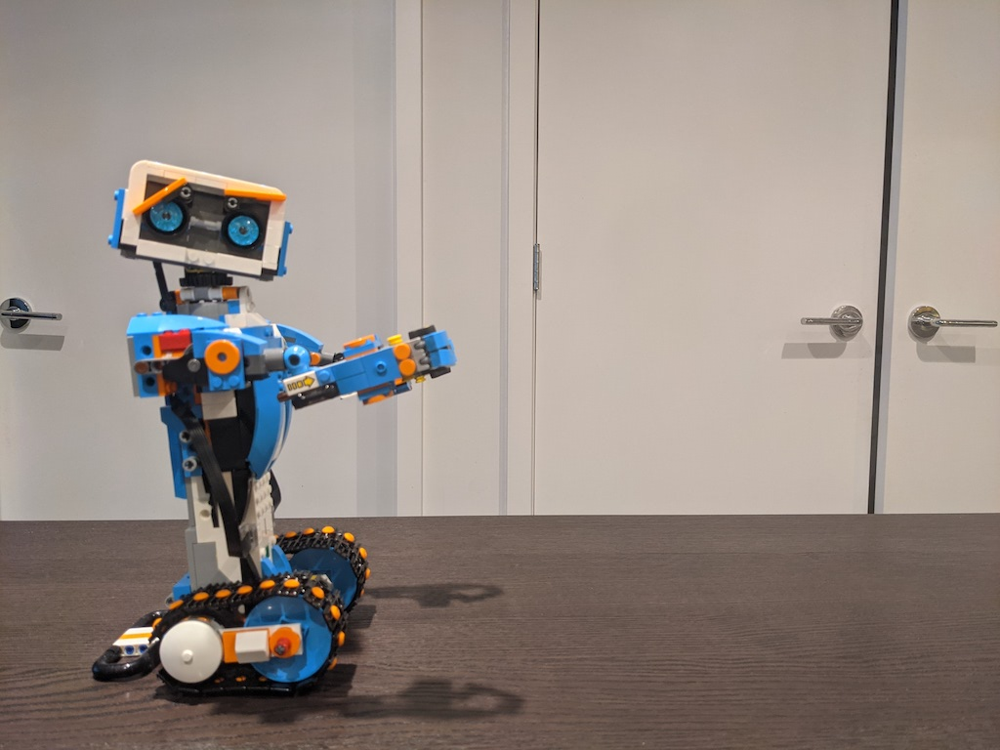
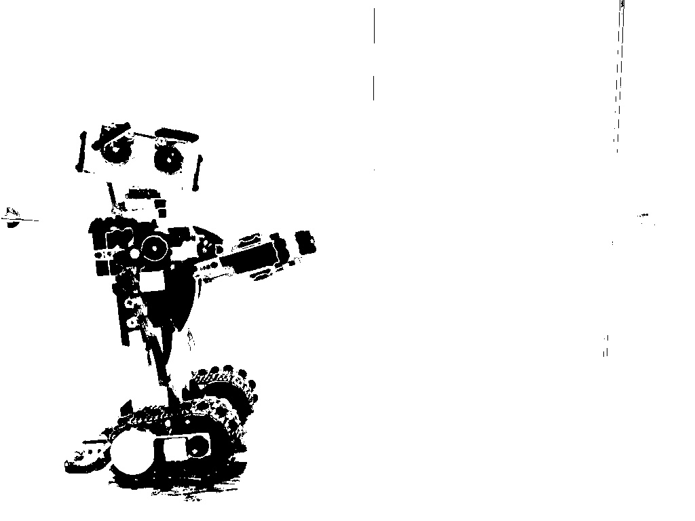
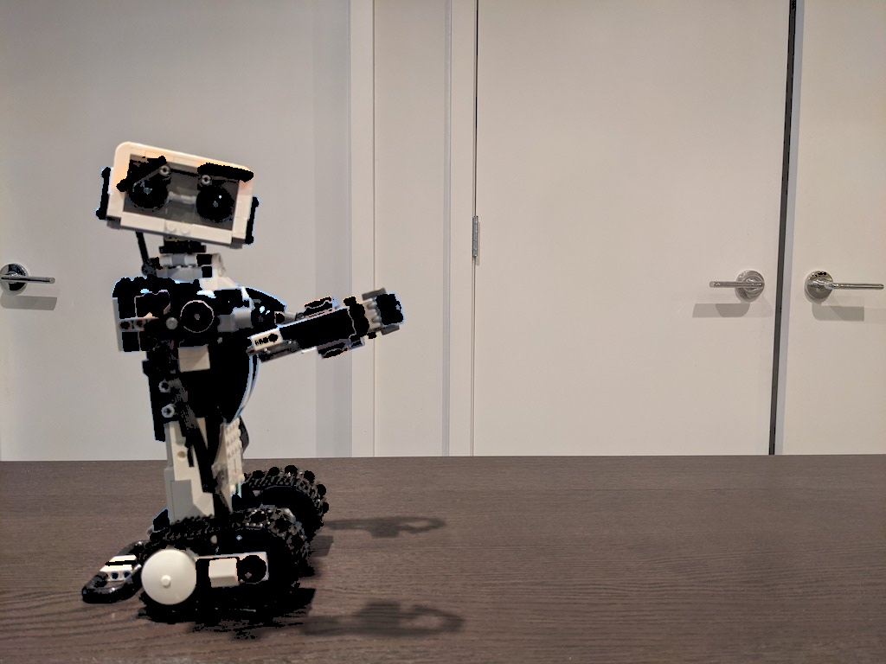

# opencv-playground

Playaround with OpenCV to detect images

## Setup
```
pipenv shell
pipenv install
```

## Run
```
python3 lego_boost_playground.py
```
| Original | Mask | Combined |
| --- | --- | --- |
|  |  |  |  
